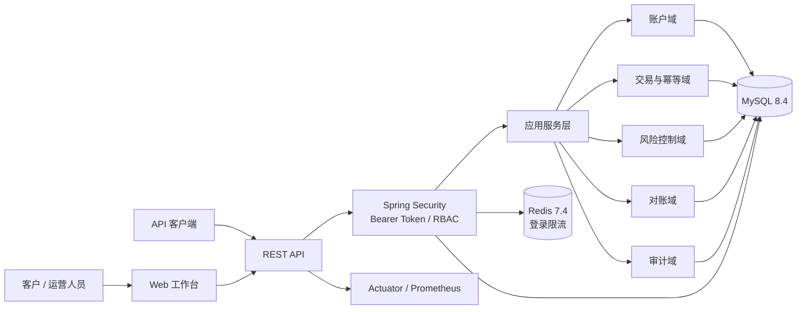
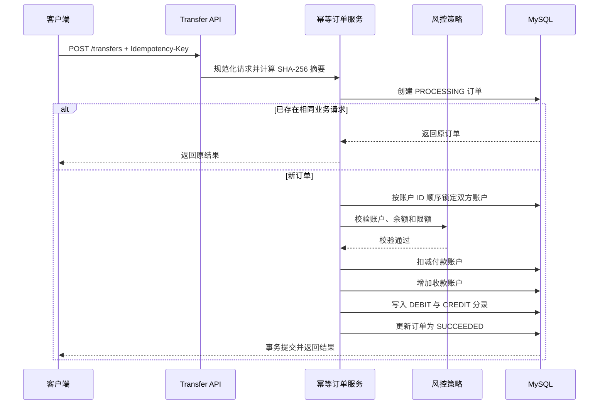
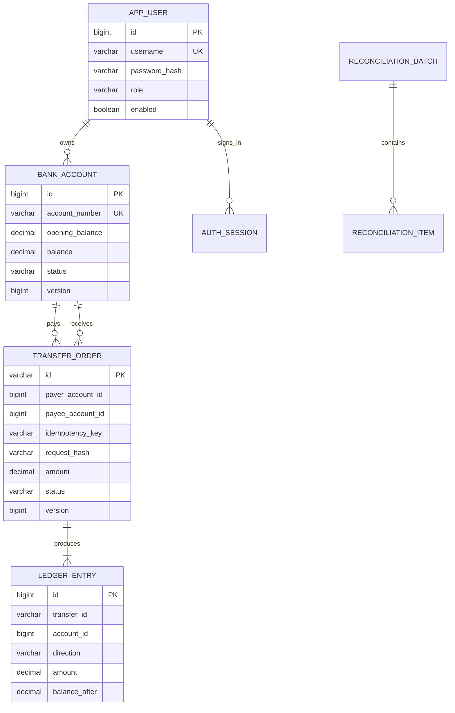

# Mobile Banking：移动银行核心业务与运营平台

[](https://github.com/1781988/Mobile_Banking/actions/workflows/ci.yml)


Mobile Banking 是一套基于 Java 21 与 Spring Boot 3 构建的数字银行核心业务与运营管理平台。系统围绕客户账户、行内转账、账务流水、交易幂等、风险控制、操作审计和日终对账形成完整业务链路，并提供容器化部署、数据库迁移、健康检查、指标监控和自动化测试能力。

系统默认运行于受控的开发、测试和功能验证环境，不连接外部银行卡组织、清算网络或第三方支付机构。接入真实资金和客户数据前，需要进一步完成身份核验、反洗钱、密钥管理、数据保护、灾备、监管和安全评审等工作。

---

## 1. 项目概览

### 1.1 业务范围

系统由客户业务、运营管理和平台支撑三部分组成：

| 领域 | 主要能力 |
|---|---|
| 客户与认证 | 用户登录、安全退出、会话管理、角色授权、登录失败限制 |
| 账户 | 本人账户查询、余额查询、账户状态、账户流水 |
| 转账 | CNY 行内转账、幂等重试、订单状态、交易查询 |
| 账务 | 借方与贷方分录、交易前后余额、对手方信息 |
| 风控 | 单笔限额、日累计限额、余额不足、账户状态检查、风险事件 |
| 运营 | 全量账户查询、账户冻结与解冻、风险复核、审计查询 |
| 对账 | 手工对账、定时对账、批次记录、账户差异明细 |
| 平台 | OpenAPI、健康检查、Prometheus 指标、请求链路标识 |
| 工程 | Flyway、Docker Compose、Maven、GitHub Actions |

### 1.2 设计原则

- 资金正确性优先于单纯追求吞吐量；
- 余额、交易订单和账务流水必须具备清晰的一致性边界；
- 客户端超时或重试不能造成重复扣款；
- 业务失败需要有稳定错误码、风险记录和审计信息；
- 配置、数据库结构和运行环境应可重复创建；
- Redis 不参与资金正确性的最终判定，核心账务以 MySQL 事务和约束为准。

---

## 2. 核心功能

### 2.1 客户端功能

- 用户名和密码登录；
- 不透明访问令牌认证；
- 查询本人账户、状态与可用余额；
- 发起 CNY 行内转账；
- 使用 `Idempotency-Key` 安全重试；
- 查询本人转入、转出交易；
- 查询账户借贷流水及交易后余额；
- 通过中文 Web 工作台完成日常操作。

### 2.2 运营管理功能

- 查询客户账户；
- 冻结或解冻账户并记录操作原因；
- 查询单笔限额、日累计限额、余额不足等风险事件；
- 查询登录、转账、账户管控和对账审计日志；
- 手工执行对账；
- 查询历史对账批次；
- 查看逐账户账面余额、计算余额和差异金额；
- 按配置时间自动执行日终对账。

### 2.3 平台与运维功能

- OpenAPI 3 与 Swagger UI；
- Actuator 健康检查、存活探针和就绪探针；
- Prometheus 指标端点；
- 全链路 `X-Request-Id`；
- Flyway 数据库版本迁移；
- Docker 多阶段构建和非 root 运行；
- MySQL、Redis、应用一键编排；
- H2 业务测试与 MySQL 迁移校验；
- GitHub Actions 持续集成。

---

## 3. 系统架构



当前采用模块化单体架构。账户、订单和流水位于同一数据库中，可以使用本地事务形成明确的一致性边界，避免在核心记账链路中过早引入分布式事务。

### 3.1 代码结构

```text
src/main/java/com/mobilebanking/platform
├── account          # 账户实体、查询、冻结与解冻
├── audit            # 审计日志
├── auth             # 登录、令牌、限流和认证过滤器
├── bootstrap        # 可关闭的本地初始化数据
├── common           # 响应、异常、金额与脱敏工具
├── config           # 安全、时钟、OpenAPI 和配置属性
├── reconciliation   # 对账批次、差异项和调度器
├── risk             # 风险事件
├── transfer         # 幂等订单、账户锁、双边流水和恢复任务
└── user             # 用户与角色
```

详细设计见 [docs/ARCHITECTURE.md](docs/ARCHITECTURE.md)。

---

## 4. 核心交易实现

### 4.1 金额模型

资金金额在 Java 中统一使用 `BigDecimal`，在 MySQL 中使用 `DECIMAL(19,2)`：

- 不使用 `double` 或 `float` 参与资金运算；
- 金额必须为正数；
- 金额最多保留两位小数；
- 余额更新和流水写入使用相同金额对象；
- 数据库字段精度与应用校验保持一致。

### 4.2 转账流程



### 4.3 事务与并发控制

转账执行阶段在同一个数据库事务中完成：

1. 锁定交易订单；
2. 按账户主键固定顺序锁定付款账户和收款账户；
3. 校验账户状态、币种、余额和限额；
4. 更新双方余额；
5. 写入两条账务流水；
6. 将订单更新为成功状态。

双方账户使用悲观写锁，固定锁顺序可以降低相反方向并发转账产生死锁的概率。账户表同时保留版本字段，用于识别额外的并发冲突。

### 4.4 幂等控制

客户端每次业务转账需要生成 8～64 位的 `Idempotency-Key`。系统以付款账户、幂等键、请求摘要和数据库唯一约束共同控制重复请求：

- 相同付款账户、相同幂等键、相同请求内容：返回原订单，不重复扣款；
- 相同付款账户、相同幂等键、不同请求内容：返回 `IDEMPOTENCY_CONFLICT`；
- 首次执行失败：订单保存为 `FAILED`，后续相同请求返回原失败结果；
- 订单创建后服务中断：订单保留为 `PROCESSING`，由恢复任务处理超时状态。

### 4.5 双边账务流水

每笔成功转账生成两条分录：

- 付款账户：`DEBIT`；
- 收款账户：`CREDIT`。

流水记录包含交易编号、账户、借贷方向、金额、交易前余额、交易后余额、对手方账户、备注和创建时间。账户余额用于在线查询，流水用于账单展示、问题追踪和对账计算。

### 4.6 风险控制

当前同步规则包括：

- 账户是否存在；
- 付款账户是否属于当前客户；
- 付款与收款账户是否处于可交易状态；
- 是否为同币种账户；
- 是否为自己向自己转账；
- 余额是否充足；
- 是否超过单笔限额；
- 是否超过业务日累计转出限额。

被拦截的交易会形成风险事件，记录规则代码、风险等级、账户、金额、请求编号和原因。

### 4.7 超时订单恢复

订单先以 `PROCESSING` 状态落库。恢复任务按照配置周期扫描超过处理时限的订单，将其终止并记录失败原因。余额和流水只会在资金事务成功提交时发生变化，因此处理中订单不会形成部分扣款。

### 4.8 日终对账

系统按账户重新计算余额：

```text
calculated_balance = opening_balance + sum(CREDIT) - sum(DEBIT)
difference = persisted_balance - calculated_balance
```

对账结果包含批次、业务日期、账户数量、平账数量、差异数量和逐账户差异。对账事务使用一致性快照，避免账户余额和流水汇总来自不同提交时点。

---

## 5. 身份认证与审计

### 5.1 身份认证

- 密码使用 BCrypt 单向摘要；
- 登录成功后签发安全随机的不透明令牌；
- 客户端持有令牌原文，数据库只保存 SHA-256 摘要；
- 令牌具有固定有效期，并支持立即撤销；
- `USER` 和 `ADMIN` 角色使用 RBAC 隔离；
- 登录失败次数可由本地内存或 Redis 统计；
- 登录错误统一返回，降低用户名枚举风险。

### 5.2 审计日志

以下操作会写入审计日志：

- 登录成功或失败；
- 用户退出；
- 转账发起、成功或失败；
- 账户冻结或解冻；
- 手工执行对账；
- 超时订单恢复。

审计记录包含操作人、动作、资源类型、资源编号、结果、请求编号、客户端地址、时间和必要的脱敏详情。

完整安全说明见 [docs/SECURITY.md](docs/SECURITY.md)。

---

## 6. 技术栈

| 类别 | 技术 |
|---|---|
| 语言 | Java 21 |
| 基础框架 | Spring Boot 3.5.16 |
| Web | Spring MVC、Jakarta Validation |
| 安全 | Spring Security、BCrypt、不透明 Bearer Token |
| 数据访问 | Spring Data JPA、Hibernate |
| 数据库 | MySQL 8.4 |
| 数据库迁移 | Flyway 12.10.0 |
| 缓存与限流 | Redis 7.4、Spring Data Redis |
| API 文档 | springdoc-openapi 2.8.8 |
| 可观测性 | Actuator、Micrometer、Prometheus |
| 前端 | HTML、CSS、JavaScript |
| 测试 | JUnit 5、AssertJ、Mockito、MockMvc、H2 |
| 工程交付 | Maven、Docker、Docker Compose、GitHub Actions |

---

## 7. 快速启动

### 7.1 环境要求

推荐使用 Docker Compose：

- Git 2.40+
- Docker Engine 24+ 或 Docker Desktop
- Docker Compose v2

### 7.2 获取代码

```bash
git clone https://github.com/1781988/Mobile_Banking.git
cd Mobile_Banking
```

### 7.3 创建配置

Linux 或 macOS：

```bash
cp .env.example .env
```

Windows PowerShell：

```powershell
Copy-Item .env.example .env
```

至少修改以下配置：

```dotenv
MYSQL_PASSWORD=替换为应用数据库密码
MYSQL_ROOT_PASSWORD=替换为数据库管理员密码
REDIS_PASSWORD=替换为Redis密码
```

`.env` 已被 `.gitignore` 排除，不要将本地密码提交到仓库。

### 7.4 启动服务

```bash
docker compose up -d --build
```

查看状态和日志：

```bash
docker compose ps
docker compose logs -f app
```

应用首次启动时会：

1. 创建 MySQL 和 Redis 容器；
2. 通过 Flyway 执行数据库迁移；
3. 在 `BANK_DEMO_ENABLED=true` 时创建本地初始化账户；
4. 启动 REST API、Web 工作台和健康检查端点。

### 7.5 访问地址

| 页面或端点 | 地址 |
|---|---|
| Web 工作台 | `http://localhost:8080/` |
| Swagger UI | `http://localhost:8080/swagger-ui.html` |
| OpenAPI JSON | `http://localhost:8080/v3/api-docs` |
| 健康检查 | `http://localhost:8080/actuator/health` |
| Prometheus 指标 | `http://localhost:8080/actuator/prometheus` |

Prometheus 端点需要管理员令牌。

### 7.6 本地初始化账户

`.env.example` 默认显式启用本地初始化数据：

| 角色 | 用户名 | 密码 | 账户 | 初始余额 |
|---|---|---|---|---:|
| 客户 | `alice` | `Bank@12345` | `6222026000000001` | ¥10,000.00 |
| 客户 | `bob` | `Bank@12345` | `6222026000000002` | ¥5,000.00 |
| 运营管理员 | `admin` | `Admin@12345` | 无客户账户 | — |

非本地环境应设置：

```dotenv
BANK_DEMO_ENABLED=false
```

并通过正式的数据初始化或用户开户流程创建账户。

### 7.7 停止和清理

停止服务并保留数据：

```bash
docker compose down
```

删除容器和本地数据卷：

```bash
docker compose down -v
```

---

## 8. 本地开发

### 8.1 环境要求

- JDK 21
- Maven 3.9+
- MySQL 8.0+
- Redis 7+

### 8.2 创建数据库

```sql
CREATE DATABASE mobile_banking
  CHARACTER SET utf8mb4
  COLLATE utf8mb4_0900_ai_ci;

CREATE USER 'bank_app'@'%' IDENTIFIED BY '替换为强密码';
GRANT SELECT, INSERT, UPDATE, DELETE, CREATE, ALTER, INDEX, REFERENCES
  ON mobile_banking.* TO 'bank_app'@'%';
FLUSH PRIVILEGES;
```

生产环境建议将数据库迁移账户和应用运行账户分离，运行账户只保留必要的 DML 权限。

### 8.3 设置环境变量

Linux 或 macOS：

```bash
export SPRING_DATASOURCE_URL='jdbc:mysql://localhost:3306/mobile_banking?useSSL=false&allowPublicKeyRetrieval=true&serverTimezone=Asia/Shanghai'
export SPRING_DATASOURCE_USERNAME='bank_app'
export SPRING_DATASOURCE_PASSWORD='你的数据库密码'
export SPRING_DATA_REDIS_HOST='localhost'
export SPRING_DATA_REDIS_PORT='6379'
export SPRING_DATA_REDIS_PASSWORD='你的Redis密码'
export BANK_DEMO_ENABLED='true'
export BANK_SECURITY_REDIS_RATE_LIMIT_ENABLED='true'
export MANAGEMENT_HEALTH_REDIS_ENABLED='true'
```

Windows PowerShell：

```powershell
$env:SPRING_DATASOURCE_URL = "jdbc:mysql://localhost:3306/mobile_banking?useSSL=false&allowPublicKeyRetrieval=true&serverTimezone=Asia/Shanghai"
$env:SPRING_DATASOURCE_USERNAME = "bank_app"
$env:SPRING_DATASOURCE_PASSWORD = "你的数据库密码"
$env:SPRING_DATA_REDIS_HOST = "localhost"
$env:SPRING_DATA_REDIS_PORT = "6379"
$env:SPRING_DATA_REDIS_PASSWORD = "你的Redis密码"
$env:BANK_DEMO_ENABLED = "true"
$env:BANK_SECURITY_REDIS_RATE_LIMIT_ENABLED = "true"
$env:MANAGEMENT_HEALTH_REDIS_ENABLED = "true"
```

### 8.4 编译与运行

```bash
mvn clean verify
mvn spring-boot:run
```

也可以构建 JAR：

```bash
mvn clean package
java -jar target/mobile-banking-1.0.0-SNAPSHOT.jar
```

---

## 9. API 使用示例

### 9.1 登录

```bash
curl -s -X POST http://localhost:8080/api/v1/auth/login \
  -H 'Content-Type: application/json' \
  -d '{"username":"alice","password":"Bank@12345"}'
```

响应中的 `data.accessToken` 为访问令牌。后续请求携带：

```http
Authorization: Bearer <accessToken>
```

### 9.2 查询本人账户

```bash
curl -s http://localhost:8080/api/v1/accounts \
  -H 'Authorization: Bearer <accessToken>'
```

### 9.3 发起行内转账

```bash
curl -s -X POST http://localhost:8080/api/v1/transfers \
  -H 'Authorization: Bearer <accessToken>' \
  -H 'Content-Type: application/json' \
  -H 'Idempotency-Key: transfer-20260812-0001' \
  -d '{
    "payerAccountNumber":"6222026000000001",
    "payeeAccountNumber":"6222026000000002",
    "amount":100.00,
    "remark":"日常资金划转"
  }'
```

使用相同幂等键和相同请求内容再次调用时，系统返回原交易，响应中的 `replayed` 为 `true`，不会重复扣款。

### 9.4 查询交易和流水

```bash
curl -s 'http://localhost:8080/api/v1/transfers?page=0&size=20' \
  -H 'Authorization: Bearer <accessToken>'

curl -s 'http://localhost:8080/api/v1/accounts/6222026000000001/statement?page=0&size=20' \
  -H 'Authorization: Bearer <accessToken>'
```

### 9.5 管理员执行对账

```bash
curl -s -X POST http://localhost:8080/api/v1/admin/reconciliations \
  -H 'Authorization: Bearer <adminAccessToken>'
```

更多调用示例见 [docs/API_EXAMPLES.md](docs/API_EXAMPLES.md)。

---

## 10. 主要接口

| 方法 | 路径 | 权限 | 说明 |
|---|---|---|---|
| `POST` | `/api/v1/auth/login` | 公开 | 登录并签发访问令牌 |
| `POST` | `/api/v1/auth/logout` | 登录用户 | 撤销当前令牌 |
| `GET` | `/api/v1/users/me` | 登录用户 | 获取当前用户信息 |
| `GET` | `/api/v1/accounts` | 客户 | 获取本人账户列表 |
| `GET` | `/api/v1/accounts/{accountNumber}` | 客户 | 获取本人指定账户 |
| `GET` | `/api/v1/accounts/{accountNumber}/statement` | 客户 | 获取账户流水 |
| `POST` | `/api/v1/transfers` | 客户 | 发起行内转账 |
| `GET` | `/api/v1/transfers` | 登录用户 | 获取可见交易列表 |
| `GET` | `/api/v1/transfers/{transferId}` | 登录用户 | 获取交易详情 |
| `GET` | `/api/v1/admin/accounts` | 管理员 | 获取全部账户 |
| `PUT` | `/api/v1/admin/accounts/{accountNumber}/status` | 管理员 | 冻结或解冻账户 |
| `GET` | `/api/v1/admin/risk-events` | 管理员 | 获取风险事件 |
| `GET` | `/api/v1/admin/audit-logs` | 管理员 | 获取审计日志 |
| `POST` | `/api/v1/admin/reconciliations` | 管理员 | 手工执行对账 |
| `GET` | `/api/v1/admin/reconciliations` | 管理员 | 获取对账批次 |
| `GET` | `/api/v1/admin/reconciliations/latest` | 管理员 | 获取最新对账结果 |
| `GET` | `/api/v1/admin/reconciliations/{batchId}` | 管理员 | 获取批次和差异项 |

所有业务响应都包含 `requestId`。错误响应同时返回稳定的业务错误码，便于客户端处理和日志检索。

---

## 11. 配置项

| 环境变量 | 默认值 | 说明 |
|---|---|---|
| `BANK_DEMO_ENABLED` | `false` | 是否创建本地初始化账户 |
| `BANK_SECURITY_TOKEN_TTL` | `PT8H` | 登录令牌有效期 |
| `BANK_SECURITY_LOGIN_MAX_FAILURES` | `5` | 登录窗口内最大失败次数 |
| `BANK_SECURITY_LOGIN_WINDOW` | `PT10M` | 登录失败统计窗口 |
| `BANK_SECURITY_REDIS_RATE_LIMIT_ENABLED` | `false` | 是否使用 Redis 共享登录限流 |
| `BANK_TRANSFER_SINGLE_LIMIT` | `50000.00` | 单笔转账限额 |
| `BANK_TRANSFER_DAILY_LIMIT` | `100000.00` | 单账户日累计转出限额 |
| `BANK_TRANSFER_ZONE_ID` | `Asia/Shanghai` | 业务日和限额统计时区 |
| `BANK_TRANSFER_PROCESSING_TIMEOUT` | `PT5M` | 处理中订单超时时间 |
| `BANK_TRANSFER_RECOVERY_INTERVAL` | `PT1M` | 超时订单扫描间隔 |
| `BANK_RECONCILIATION_CRON` | `0 0 2 * * *` | 自动对账 Cron |
| `MANAGEMENT_HEALTH_REDIS_ENABLED` | `false` | Redis 是否参与健康状态 |
| `SERVER_FORWARD_HEADERS_STRATEGY` | `none` | 是否信任反向代理转发头 |
| `DB_POOL_MIN_IDLE` | `2` | Hikari 最小空闲连接数 |
| `DB_POOL_MAX_SIZE` | `10` | Hikari 最大连接数 |

生产配置应由 Kubernetes Secret、云密钥管理服务或 CI/CD Secret 注入，不要将密码写入 `application.yml`、镜像或 Git 仓库。

---

## 12. 数据模型



数据库结构由 `src/main/resources/db/migration/V1__create_core_schema.sql` 管理。

---

## 13. 测试与持续集成

### 13.1 本地测试

```bash
mvn clean verify
```

测试覆盖：

- 金额精度和非法金额；
- 账户扣款、入账、余额不足和冻结状态；
- 单笔限额和日累计限额；
- 登录失败限制；
- Spring 上下文和 JPA 映射；
- 登录、转账、双边流水和幂等重放的 API 流程。

### 13.2 GitHub Actions

CI 包含两个任务：

1. 使用 H2 编译并执行单元测试、上下文测试和 API 测试；
2. 启动 MySQL 8.4，执行 Flyway 迁移并验证 Hibernate 映射。

### 13.3 冒烟测试

服务启动后执行：

```bash
chmod +x scripts/smoke-test.sh
./scripts/smoke-test.sh
```

也可以覆盖默认参数：

```bash
BASE_URL=http://localhost:8080 \
BANK_USERNAME=alice \
BANK_PASSWORD='Bank@12345' \
./scripts/smoke-test.sh
```

---

## 14. 运行与排障

### 14.1 查看服务状态

```bash
curl http://localhost:8080/actuator/health

docker compose ps
docker compose logs mysql
docker compose logs redis
docker compose logs app
```

### 14.2 数据库连接失败

确认 `.env` 中的 `MYSQL_PASSWORD` 与数据库初始化密码一致。MySQL 数据卷创建后，直接修改环境变量不会自动修改既有数据库用户密码。

在仅需重建本地数据时可以执行：

```bash
docker compose down -v
docker compose up -d --build
```

该命令会删除本地数据库数据。

### 14.3 Redis 健康检查失败

确认 `REDIS_PASSWORD` 已同时配置给 Redis 容器和应用。资金交易不依赖 Redis，但启用 Redis 登录限流和健康检查后，Redis 不可用会影响应用就绪状态。

### 14.4 转账返回幂等冲突

同一个 `Idempotency-Key` 已被用于不同的付款账户、收款账户、金额或备注。新的业务请求应生成新的幂等键；网络重试应复用原幂等键和原请求内容。

### 14.5 对账出现差异

管理员可以通过批次详情查看：

- `persistedBalance`：账户表当前余额；
- `calculatedBalance`：期初余额加贷方流水减借方流水；
- `difference`：两者差额。

正常交易会在同一事务中提交余额和流水。差异通常表示未受控的数据修改、错误迁移或外部写入。

---

## 15. 部署与安全注意事项

当前 Docker Compose 适用于本地开发和单机环境验证。进一步部署时应至少评估：

- TLS、反向代理和 WAF；
- 可信代理链与客户端地址解析；
- 数据库最小权限和迁移账户分离；
- 密钥托管和定期轮换；
- PII 加密、脱敏和访问审计；
- MFA、设备识别和交易确认；
- KYC、AML、名单筛查和案件处置；
- 日志集中采集、SIEM 和告警；
- 数据备份、恢复和灾备演练；
- SAST、SCA、容器扫描和渗透测试；
- 多实例定时任务互斥和数据库高可用。

应用默认不信任客户端提交的转发头。只有部署在可信反向代理之后，并确保代理删除客户端自带的 `Forwarded` 和 `X-Forwarded-*` 后，才应将 `SERVER_FORWARD_HEADERS_STRATEGY` 设置为 `framework`。

---

## 16. 后续演进

### 16.1 业务能力

- 开户和客户资料管理；
- 收款人管理与新增收款人冷静期；
- OTP 或 MFA 交易确认；
- 交易通知；
- 风险事件审核和处置流程；
- 对账差异工单。

### 16.2 一致性与异步化

- Outbox 事件表；
- Kafka 或 RabbitMQ 通知；
- 外部支付渠道订单；
- 回调幂等和补偿机制；
- 对账任务租约；
- 人工处理工作流。

### 16.3 可观测性与规模

- Grafana 仪表盘和告警规则；
- 并发转账压测；
- Testcontainers MySQL 一致性测试；
- Kubernetes 部署；
- 数据库高可用和读写分离；
- 容量模型、SLO、RPO 与 RTO。

---

## 17. 项目文档

| 文档 | 内容 |
|---|---|
| [ARCHITECTURE.md](docs/ARCHITECTURE.md) | 模块边界、事务、锁、状态机、部署和演进路线 |
| [SECURITY.md](docs/SECURITY.md) | 认证、授权、数据保护和生产加固清单 |
| [API_EXAMPLES.md](docs/API_EXAMPLES.md) | API 调用示例和完整业务流程 |
| [DESIGN_DECISIONS.md](docs/DESIGN_DECISIONS.md) | 关键技术决策及其权衡 |
| [CHANGELOG.md](CHANGELOG.md) | 版本变更记录 |

---

## 18. 常用命令

```bash
make test       # 执行测试
make package    # 构建 JAR
make run        # 本地 Maven 启动
make up         # Docker Compose 构建并启动
make logs       # 查看应用日志
make down       # 停止容器
make clean      # 清理 Maven 构建产物
```

---

## 19. 许可证

项目代码采用 [Apache License 2.0](LICENSE)。其他说明见 [NOTICE.md](NOTICE.md)。
