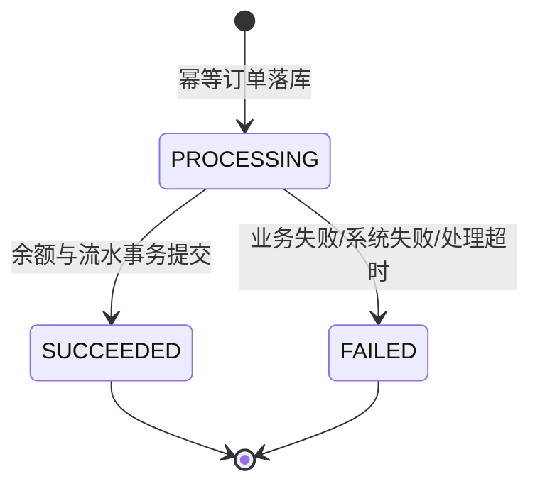

# Mobile Banking 架构设计

## 1. 设计目标

系统围绕以下优先级设计：

1. 资金正确性高于吞吐量；
2. 业务失败必须可解释、可追踪；
3. 客户重试不能造成重复扣款；
4. 运维人员能够发现账务差异；
5. 本地环境能够重复部署和自动验证；
6. 核心模块保持清晰边界，便于单团队维护和持续迭代。

## 2. 架构风格

当前采用模块化单体，而不是微服务：

- 所有资金数据位于同一个 MySQL 实例；
- 账户、订单和流水可以由单个本地事务保证原子性；
- 模块通过 Java 服务接口协作，无远程调用和分布式事务；
- 便于在有限资源下部署、调试和压测。

当业务规模和团队边界明确后，可将通知、风控、对账和报表逐步异步化，但账户记账核心不应为了“看起来先进”过早拆分。

## 3. 模块职责

### 3.1 Auth

- BCrypt 密码校验；
- 登录失败次数限制；
- 生成 256 位随机不透明 Token；
- Token 摘要入库；
- 认证过滤器与 RBAC；
- 退出与过期会话清理。

### 3.2 Account

- 账户归属和余额查询；
- 账户状态；
- 领域方法 `debit`、`credit`；
- 管理员冻结和解冻。

### 3.3 Transfer

- 请求规范化；
- 幂等键与请求摘要；
- 订单状态机；
- 双账户加锁；
- 余额与限额验证；
- 双边流水；
- 处理中订单恢复。

订单状态：



`SUCCEEDED` 和 `FAILED` 都是终态。相同幂等键不会创建第二个业务结果。

### 3.4 Risk

当前为同步规则：

- 单笔金额上限；
- 单账户业务日累计成功转出上限；
- 账户状态、余额、币种和自转账校验；
- 拦截结果持久化为风险事件。

后续可增加设备、IP、收款人、时间段、频率和模型评分。

### 3.5 Audit

审计日志记录：

- 操作人；
- 动作；
- 资源类型与资源 ID；
- 成功或失败；
- 请求 ID；
- 客户端 IP；
- 必要的脱敏详情；
- UTC 时间。

### 3.6 Reconciliation

对每个账户计算：

```text
calculated_balance = opening_balance + sum(CREDIT) - sum(DEBIT)
difference = persisted_balance - calculated_balance
```

对账事务使用 `REPEATABLE_READ`，避免在读取账户和流水期间看到不同提交时点的数据。结果分为批次与逐账户差异项。

## 4. 交易一致性

### 4.1 为什么使用数据库行锁

余额、订单和流水都在 MySQL 中。数据库行锁有以下优势：

- 锁与事务具有相同生命周期；
- 应用崩溃时数据库自动释放锁；
- 不需要处理 Redis 锁续期、网络分区和数据库事务回滚之间的组合；
- 多实例应用仍对同一数据库行形成互斥。

### 4.2 固定锁顺序

查询双方账户时使用：

```sql
SELECT ...
FROM bank_account
WHERE account_number IN (?, ?)
ORDER BY id
FOR UPDATE;
```

不同方向的并发转账都会按相同账户 ID 顺序加锁，降低 A→B 与 B→A 互相等待的概率。

### 4.3 幂等订单与执行事务

幂等订单使用独立事务先创建为 `PROCESSING`。这样即使后续执行进程中断，也可以看到一次明确的业务尝试。

资金执行事务包含：

- 锁定订单；
- 锁定双方账户；
- 风控与余额校验；
- 更新余额；
- 写入两条流水；
- 标记订单成功。

执行事务失败时全部回滚，再由失败服务在独立事务中将订单标记为 `FAILED`。

### 4.4 崩溃场景

| 崩溃位置 | 数据结果 | 恢复方式 |
|---|---|---|
| 订单创建前 | 无订单、无资金变化 | 客户端可使用原幂等键重试 |
| 订单创建后、执行前 | `PROCESSING`，无资金变化 | 重复请求返回处理中；超时恢复任务标记失败 |
| 执行事务提交前 | 执行事务回滚，无部分资金变化 | 标记失败或超时恢复 |
| 执行事务提交后 | 订单成功、余额和流水均存在 | 重复请求返回原成功订单 |

## 5. 数据与时间

- 金额统一两位小数；
- 时间持久化使用 UTC `Instant`；
- 业务日按 `BANK_TRANSFER_ZONE_ID` 计算；
- 前端按浏览器本地时区展示；
- 账户表保存期初余额，用于当前账务模型的全量对账。

## 6. 可用性与可观测性

- `/actuator/health/liveness`：进程存活；
- `/actuator/health/readiness`：应用就绪；
- `/actuator/prometheus`：指标采集；
- 日志包含请求 ID；
- API 响应返回相同请求 ID；
- Docker 健康检查调用就绪探针；
- CI 使用 H2 验证业务测试，使用 MySQL 验证迁移和映射。

## 7. 部署拓扑

当前 Docker Compose 适合本地开发和单机环境验证：

```text
Browser/API Client
        |
      :8080
        |
  Mobile Banking App
     /          \
 MySQL         Redis
```

生产演进建议：

```text
WAF / API Gateway / TLS
          |
Load Balancer
   |             |
App Instance  App Instance
   |             |
   +------ MySQL HA ------+
   +------ Redis HA ------+
          |
Prometheus / Logs / SIEM
```

多实例环境中的定时对账应由外部调度平台或数据库租约保证单次执行，避免每个实例同时触发。

## 8. 后续演进顺序

### 阶段一：业务完整性

- 收款人管理；
- 转账验证码或 MFA；
- 交易通知；
- 账户开户与客户资料；
- 管理员分页筛选和导出。

### 阶段二：一致性与异步化

- Outbox 表；
- Kafka/RabbitMQ 通知；
- 对账任务租约；
- 外部渠道订单和回调幂等；
- 补偿与人工处理工作流。

### 阶段三：安全与风控

- 设备指纹；
- 登录和交易异常检测；
- 黑名单、灰名单和案件管理；
- MFA、密钥轮换和 HSM；
- 审计日志远程不可变存储。

### 阶段四：规模与容灾

- 读写分离；
- 账户分片；
- 多地域灾备；
- RPO/RTO 演练；
- 压测、容量模型和 SLO。
